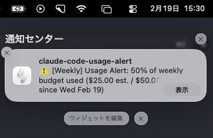

**English** | [日本語](README.ja.md)

# claude-code-usage-alert

> Real-time session budget alerts for Claude Code, powered by [Hooks](https://docs.anthropic.com/en/docs/claude-code/hooks).

Claude Code does not expose a usage API or built-in budget limits for Max plan users. **claude-code-usage-alert** fills that gap by parsing transcript JSONL files after every turn and alerting you when your estimated spend crosses configurable thresholds -- all without leaving your terminal.

## Features

- **Native Claude Code integration** -- runs as a Stop / SessionStart / SessionEnd hook; no extra window or process to manage
- **Tiered threshold alerts** -- default at 50%, 80%, 90% (fully customizable)
- **Dual notification channels** -- in-terminal `systemMessage` warnings + OS-native desktop notifications
- **Incremental transcript parsing** -- reads only new bytes since the last check; fast and low overhead
- **macOS + Linux** -- uses `osascript` on macOS and `notify-send` on Linux
- **Near-zero dependencies** -- only [`yaml`](https://github.com/eemeli/yaml) at runtime



## Use Cases

### Max plan users: anticipate daily limit before it hits

Max plan (Pro / Max 5x) charges a flat monthly fee, but there is a daily usage cap. Since Anthropic does not expose this cap or your current usage rate via API, you have no way to know how close you are until you hit the wall.

With claude-code-usage-alert, you receive notifications when your estimated session spend crosses your configured thresholds, giving you a sense of pace before your work is suddenly interrupted.

> **Note:** The dollar amounts shown in alerts are API-equivalent estimates, not actual Max plan limit consumption. They serve as a relative indicator of how much resource you are using in the current session.

### Users who switch between Max plan and API

Some users switch to an API key when they hit the Max plan's daily limit. Under API billing, you pay per token, so cost awareness during a session becomes more important.

Setting a session budget helps you keep track of roughly how much you are spending per session, regardless of which billing mode you are on.

### Shared cost awareness across teams

When team members use Claude Code daily, configuring a per-person session budget creates a lightweight self-awareness mechanism to prevent unexpectedly heavy usage.

## Quick Start

```bash
npm install -g claude-code-usage-alert
claude-code-usage-alert setup          # creates config, registers hooks
```

That's it. Next time you start a Claude Code session, budget tracking is active.

## How It Works

```
Claude Code session
       |
       v
 [SessionStart hook]  -->  Initialize session state
       |
       v
  ... conversation ...
       |
       v
  [Stop hook]  ---------->  1. Read transcript JSONL (incremental, from last byte offset)
       |                     2. Sum token counts (input / output / cache_read / cache_creation)
       |                     3. Compute cost in USD using model pricing table
       |                     4. Compare cumulative cost against session budget
       |                     5. If a threshold is crossed:
       |                        - Output { "systemMessage": "..." } to stdout (terminal alert)
       |                        - Fire OS desktop notification
       |
       v
  ... conversation ...
       |
       v
 [SessionEnd hook]  -->  Clear session state
```

### Key design decisions

| Decision | Rationale |
|----------|-----------|
| Budget is user-defined, not API-derived | Anthropic does not expose a usage/remaining API for Max plan |
| Incremental byte-offset parsing | Avoids re-reading the entire transcript on every turn |
| Never crashes | `main().catch()` and per-handler try/catch ensure hook failures are silent |
| `systemMessage` output | Official Hooks contract -- Claude Code reads this from stdout and displays it inline |

## Configuration

Configuration lives at `~/.claude-code-usage-alert/config.yml`. Created automatically by `claude-code-usage-alert setup`.

```yaml
# ~/.claude-code-usage-alert/config.yml

budget:
  mode: cost
  # Session budget in USD
  sessionBudget: 5.00
  # Weekly budget in USD
  weeklyBudget: 50.00
  # Day of week to reset weekly counter (check your plan's reset day at claude.ai)
  weeklyResetDay: monday
  # Hour of day to reset weekly counter (0-23, match your plan's reset time)
  weeklyResetHour: 0

thresholds:
  - percent: 50
    notify: terminal    # terminal only
  - percent: 80
    notify: both        # terminal + desktop
  - percent: 90
    notify: both        # terminal + desktop

notifications:
  desktop: true
  terminal: true
  sound: false
```

### Configuration reference

| Key | Type | Default | Description |
|-----|------|---------|-------------|
| `budget.mode` | `"cost"` | `"cost"` | Budget mode (currently only cost-based) |
| `budget.sessionBudget` | `number` | `5.00` | Session budget in USD |
| `budget.weeklyBudget` | `number` | `50.00` | Weekly budget in USD |
| `budget.weeklyResetDay` | `string` | `"monday"` | Day of week to reset weekly counter |
| `budget.weeklyResetHour` | `number` | `0` | Hour of day (0-23) to reset weekly counter |
| `thresholds[].percent` | `number` | `50, 80, 90` | Percentage thresholds that trigger alerts |
| `thresholds[].notify` | `"terminal" \| "desktop" \| "both"` | varies | Notification method per threshold |
| `notifications.desktop` | `boolean` | `true` | Enable/disable desktop notifications |
| `notifications.terminal` | `boolean` | `true` | Enable/disable terminal (systemMessage) notifications |
| `notifications.sound` | `boolean` | `false` | Enable/disable notification sound |

## Commands

### `claude-code-usage-alert setup`

One-time initialization:

1. Creates `~/.claude-code-usage-alert/config.yml` with default settings
2. Creates `~/.claude-code-usage-alert/state.json` for session tracking
3. Registers Stop, SessionStart, and SessionEnd hooks in `~/.claude/settings.json`

Existing hooks in your settings.json are preserved -- the command merges without overwriting.

### `claude-code-usage-alert hook <event>`

Hook handler invoked automatically by Claude Code. You should not call this directly.

| Event | Behavior |
|-------|----------|
| `SessionStart` | Initializes or restores session state |
| `Stop` | Parses new transcript data, calculates cost, checks thresholds, sends notifications |
| `SessionEnd` | Clears session state |

### `claude-code-usage-alert status`

Displays current session information:

```
=== claude-code-usage-alert Status ===

Session ID:  abc123
Started at:  2026-02-18T10:30:00.000Z

Budget:      $5.00
Used:        $2.3456 (47%)
Remaining:   $2.6544

Tokens:
  Input:          125,000
  Output:         45,000
  Cache Read:     80,000
  Cache Creation: 10,000

Next alert:  at 50%
```

### `claude-code-usage-alert config [options]`

View or modify configuration from the command line.

```bash
# Show current config
claude-code-usage-alert config

# Set session budget to $10
claude-code-usage-alert config --budget 10.00

# Set custom thresholds
claude-code-usage-alert config --thresholds 30,60,90
```

## Architecture

```
src/
  index.ts                    CLI entry point (subcommand router)
  commands/
    setup.ts                  Setup wizard + hook registration
    hook.ts                   Hook event handler (Stop / SessionStart / SessionEnd)
    status.ts                 Current session status display
    config.ts                 Config CLI viewer/modifier
  core/
    transcript-parser.ts      Incremental JSONL parser (byte-offset based)
    pricing.ts                Model pricing table + cost calculation
    usage-calculator.ts       Percentage calculation + threshold checking
    state-manager.ts          Session state persistence (~/.claude-code-usage-alert/state.json)
  config/
    defaults.ts               Default config values + TypeScript interfaces
    loader.ts                 YAML config loader/saver (~/.claude-code-usage-alert/config.yml)
  notification/
    desktop.ts                OS-native desktop notifications (osascript / notify-send)
    terminal.ts               systemMessage JSON formatter
    dispatcher.ts             Routes notifications to terminal and/or desktop
  utils/
    platform.ts               Platform detection (darwin / linux)
```

### Data flow (Stop hook)

```
stdin (JSON from Claude Code)
  |
  v
hook.ts: parseHookInput()
  |
  +-- transcript-parser.ts: parseTranscript(path, offset)
  |     |
  |     +-- Reads bytes [offset..EOF] from transcript JSONL
  |     +-- Returns { totalTokens, model, newOffset }
  |
  +-- pricing.ts: calculateCost(tokens, model)
  |     |
  |     +-- Looks up model in PRICING_TABLE
  |     +-- Returns cost in USD
  |
  +-- state-manager.ts: updateSession(state, tokens, cost, offset)
  |
  +-- usage-calculator.ts: getUsagePercent() + checkThresholds()
  |
  +-- dispatcher.ts: notify()
        |
        +-- terminal.ts: formatSystemMessage() --> stdout
        +-- desktop.ts: sendDesktopNotification() --> osascript / notify-send
```

### Supported models

| Model | Input (per 1M tokens) | Output (per 1M tokens) | Cache Read | Cache Creation |
|-------|----------------------:|----------------------:|-----------:|---------------:|
| claude-opus-4-6 | $15.00 | $75.00 | $1.50 | $18.75 |
| claude-sonnet-4-5 | $3.00 | $15.00 | $0.30 | $3.75 |
| claude-haiku-4-5 | $0.80 | $4.00 | $0.08 | $1.00 |

Model names are resolved with prefix matching (e.g., `claude-sonnet-4-5-20250514` maps to `claude-sonnet-4-5`) and keyword fallback (`opus`, `sonnet`, `haiku`).

## FAQ

### Can this tool read the exact Max plan usage limit from Anthropic?

No. Anthropic does not expose a usage rate or remaining-budget API for Max plan subscribers. This tool uses a **user-defined session budget** as a proxy. You set the amount you consider reasonable for a single session, and the tool alerts you as you approach it.

### How does this differ from [ccusage](https://github.com/ryoppippi/ccusage)?

ccusage is a **post-hoc analysis** tool -- you run it after a session to see how many tokens you used. claude-code-usage-alert is a **real-time notification** tool that runs inside Claude Code via Hooks and warns you *during* your session before you exceed your budget. The JSONL parsing approach is inspired by ccusage.

### Will this slow down Claude Code?

No. The Stop hook runs after each assistant turn with a 5-second timeout. Incremental parsing only reads new bytes since the last check, so it typically completes in single-digit milliseconds. If the hook fails or times out, Claude Code silently ignores it.

### What do the dollar amounts in alerts mean?

The dollar amounts (e.g., `$2.50 est. / $5.00`) are **API-equivalent cost estimates**, not actual charges. They are calculated by multiplying your token usage by the published per-token API pricing. For Max plan users who pay a flat monthly fee, these amounts serve as a relative indicator of how intensively you are using the session -- not as a billing statement.

### Does this track usage across sessions?

Yes. In addition to per-session tracking, the tool accumulates estimated costs across all sessions within a configurable weekly window. You can set a `weeklyBudget` and `weeklyResetDay` in your config to receive weekly threshold alerts (prefixed with `[Weekly]`). Session history is stored locally in `~/.claude-code-usage-alert/state.json`.

### Does the weekly budget match Anthropic's actual weekly limit?

No. Anthropic does not expose weekly limit data via API. The weekly budget is a **user-defined target** based on estimated API-equivalent costs. It does not correspond to the "Weekly Limit" bar shown on the claude.ai dashboard. However, it gives you a consistent way to gauge your usage intensity across sessions over the week.

### Can I start using this tool in the middle of a week?

Yes. The tool starts tracking from the moment it is installed. Sessions before installation are not included. This means the first week's total will be lower than actual usage. From the following week onward, the full week is tracked.

### How do I find my plan's weekly reset day?

Check the "Usage Limits" section on [claude.ai](https://claude.ai). The weekly limit bar shows your reset day and time (e.g., "Resets Wednesday at 14:00"). Set `weeklyResetDay` in your config to match.

### Does it work on Windows?

Not currently. Desktop notifications use `osascript` (macOS) and `notify-send` (Linux). Windows support via PowerShell toast notifications could be added in the future.

## Comparison with Existing Tools

The Claude Code ecosystem already has excellent usage monitoring tools. claude-code-usage-alert focuses specifically on **real-time, in-session budget alerting via Hooks** -- a niche not covered by the tools below.

| Tool | Approach | Strengths | Difference from this tool |
|------|----------|-----------|--------------------------|
| [ccusage](https://github.com/ryoppippi/ccusage) | Post-session JSONL analysis | Most mature and widely adopted; accurate token/cost reports | Designed for after-session review, not real-time alerting. Our JSONL parsing approach is inspired by ccusage. |
| [Claude-Code-Usage-Monitor](https://github.com/1rgs/Claude-Code-Usage-Monitor) | Standalone terminal dashboard | Rich TUI with ML-based prediction | Runs in a separate terminal window; not integrated into Claude Code via Hooks. |
| [Claude-Usage-Tracker](https://github.com/nicekid1/Claude-Usage-Tracker) | macOS menu bar app | Polished native UI with tiered alerts | macOS only; our tiered threshold UX was inspired by this tool's design. |
| [claude-o-meter](https://github.com/ansonTGN/claude-o-meter) | Go binary, PTY scraping | Single binary, no runtime deps | Linux-focused; relies on parsing `/usage` command output which may change between CLI versions. |

Each tool solves a different part of the usage monitoring problem. If you need detailed post-session analysis, we recommend [ccusage](https://github.com/ryoppippi/ccusage). claude-code-usage-alert is designed to complement these tools by providing **proactive in-session alerts** through Claude Code's official Hooks extension point.

For a detailed requirements analysis, see [docs/competitive-analysis.md](docs/competitive-analysis.md).

## Contributing

Contributions are welcome. Please open an issue first to discuss what you would like to change.

```bash
git clone https://github.com/tackeyy/claude-code-usage-alert.git
cd claude-code-usage-alert
npm install
npm run build
npm test
```

## License

[MIT](LICENSE)
